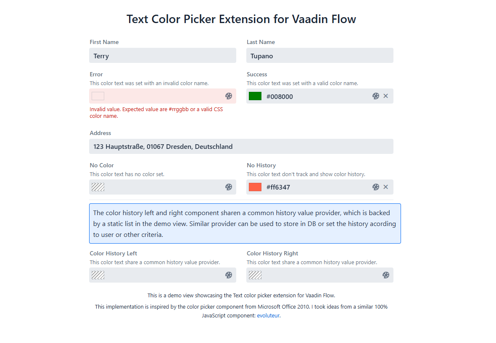
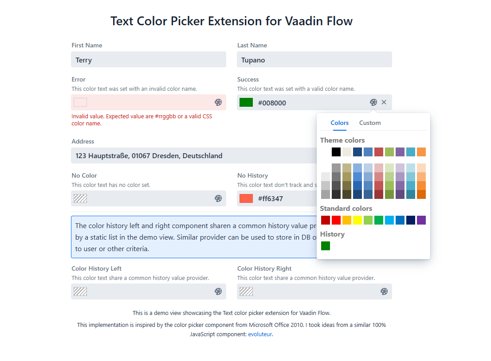
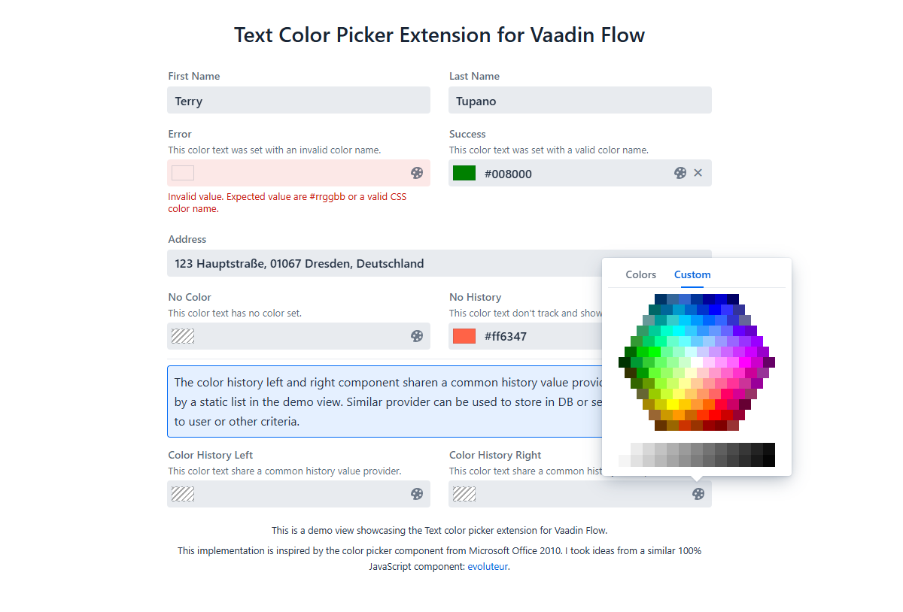

# Text color picker for Vaadin Flow
Extention of Vaading `TextField` that allows users to input and select colors. The ColorTextField provides a color preview, a color picker popover with predefined colors, and a history of selected colors. The component supports both hexadecimal color codes and CSS color names.

This implementation is inspired by the color picker component from Microsoft Office 2010. I took ideas from a similar 100% JavaScript componentfound [here](https://github.com/evoluteur/colorpicker)


## Example Code
The followin code is extracted from `ColorTextFieldTest.java` in test directory.
```java

public class ColorTextFieldTest extends VerticalLayout {

	private static List<String> staticHistory = new ArrayList<>();

	public ColorTextFieldTest() {

		// Placeholder components
		TextField firstName = new TextField("First Name");
		firstName.setValue("Terry");
		TextField lastName = new TextField("Last Name");
		lastName.setValue("Tupano");

		ColorTextField errorColor = new ColorTextField("Error");
		errorColor.addThemeVariants(TextFieldVariant.LUMO_HELPER_ABOVE_FIELD);
		errorColor.setHelperText("This color text was set with an invalid color name.");
		errorColor.setValue("blablabla");

		ColorTextField successColor = new ColorTextField("Success");
		successColor.addThemeVariants(TextFieldVariant.LUMO_HELPER_ABOVE_FIELD);
		successColor.setHelperText("This color text was set with a valid color name.");
		successColor.setValue("green");

		// placeholder component
		TextField addressField = new TextField("Address");
		addressField.setValue("123 Hauptstraße, 01067 Dresden, Deutschland");

		ColorTextField noColor = new ColorTextField("No Color");
		noColor.addThemeVariants(TextFieldVariant.LUMO_HELPER_ABOVE_FIELD);
		noColor.setHelperText("This color text has no color set.");

		ColorTextField noHistory = new ColorTextField("No History", false);
		noHistory.addThemeVariants(TextFieldVariant.LUMO_HELPER_ABOVE_FIELD);
		noHistory.setValue("tomato");
		noHistory.setHelperText("This color text don't track and show color history.");

		ValueProvider<Object, List<String>> historyProvider = v -> staticHistory;

		Span historyInfo = new Span(
				"The color history left and right components share a common history value provider, which is backed by a static list in the demo view. "
						+ "Similar provider can be used to store in DB or set the history according to user or other criteria.");
		historyInfo.getStyle().set("border", "1px solid var(--lumo-primary-color)");
		historyInfo.getStyle().set("background-color", "var(--lumo-primary-color-10pct)");
		historyInfo.getStyle().set("padding", "0.5rem");
		historyInfo.getStyle().set("border-radius", "4px");

		ColorTextField historyColor1 = new ColorTextField("Color History Left");
		historyColor1.addThemeVariants(TextFieldVariant.LUMO_HELPER_ABOVE_FIELD);
		historyColor1.setHelperText("This color text share a common history value provider.");
		historyColor1.setHistoryValueProvider(historyProvider);

		ColorTextField historyColor2 = new ColorTextField("Color History Right");
		historyColor2.addThemeVariants(TextFieldVariant.LUMO_HELPER_ABOVE_FIELD);
		historyColor2.setHelperText("This color text share a common history value provider.");
		historyColor2.setHistoryValueProvider(historyProvider);

		Hr hr = new Hr();

		// the components
		FormLayout formLayout = new FormLayout(firstName, lastName, errorColor, successColor, addressField, noColor,
				noHistory, hr,  historyInfo, historyColor1, historyColor2);
		formLayout.setColspan(addressField, 2);
		formLayout.setColspan(hr, 2);
		formLayout.setColspan(historyInfo, 2);

		// the title
		H2 header = new H2("Text Color Picker Extension for Vaadin Flow");
		header.getStyle().set("text-align", "center");

		// the footer
		String description = """
				This is a demo view showcasing the Text color picker extension for Vaadin Flow.
				<p> This implementation is inspired by the color picker component from Microsoft Office 2010. I took ideas from a similar 100% JavaScript component: <a href='https://github.com/evoluteur/colorpicker' target='_blank'>evoluteur</a>.
				""";
		Span footerSpan = new Span();
		footerSpan.getElement().setProperty("innerHTML", description);
		footerSpan.getStyle().set("font-size", "0.8rem");
		footerSpan.getStyle().set("text-align", "center");

		VerticalLayout components = new VerticalLayout();
		components.setAlignItems(Alignment.STRETCH);
		components.add(header, formLayout, footerSpan);
		components.setWidth("40%");

		add(components);
		setAlignItems(Alignment.CENTER);
	}
}
```


## install
Install the component using Vaadin Directory.

Tested versions: Vaadin 24


<!-- ## Download release
[Available in Vaadin Directory](https://vaadin.com/directory/component/color-textfield)
 -->
 
## Building and running demo
- git clone repository
- mvn jetty:run
- navigate to http://localhost:8080/ and you will see this

<p align="center">
    
    
    
</p>


## License & Author
This add-on is distributed under Apache License 2.0. For license terms, see LICENSE file.

ColorTextField add-on for Vaadin Flow is written by Terry Tupano.